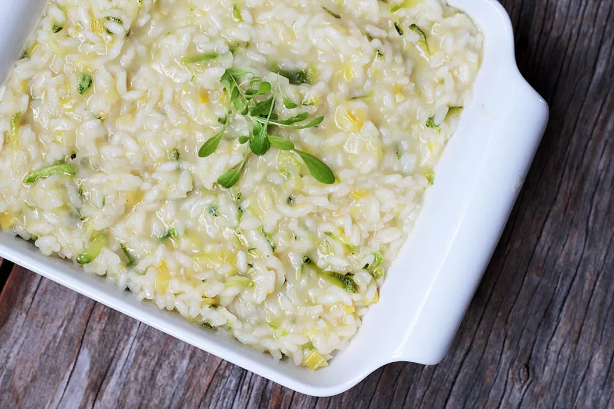

# Livro de receitas de dia das mães!
Compilado de receitas deliciosas para agradar as mães nesta data especial

## Receita de Risoto de Alho Poró
 

### Ingredientes
- 1 cebola média picada
- 1 colher (sopa) de manteiga
- 1 colher (sopa) de azeite
- 1 xícara de alho poró em rodelas (2 talos)
- 1 xícara de arroz arbóreo
- ½ xícara de vinho branco seco
- 1 l de caldo de carne ou vegetais (fervente)
- 1 xícara de abobrinha ralada
- ½ xícara de queijo parmesão ralado
- 2 colheres (sopa) de manteiga
- Pimenta preta
- Sal

### Modo de preparo
1) Leve ao fogo uma panela larga, coloque a colher de manteiga, o azeite e a cebola e refogue até ficar transparente.
2) Adicione o alho poró e o arroz arbóreo, refogue rapidamente, adicione o vinho branco e mexa até secar completamente.
3) Então comece a adicionar o caldo aos poucos, uma ou duas conchas por vez e mexendo sempre. Nessa etapa coloque um pouco de sal, mas lembre que o caldo é salgado e o queijo também.
4) Quando o arroz estiver perto de ficar pronto, coloque a abobrinha ralada, e misture bem, finalize o processo com o caldo até que o arroz esteja cozido, mas ainda al dente.
5) Desligue o fogo, adicione o queijo ralado, a manteiga gelada e misture bem.
6) Se necessário ajuste o sal, finalize com a pimenta preta e sirva.

## Receita de Muqueca 
 

### Ingredientes
 -  1 un. Pimentão Verde
 -  1 un. Pimentão Amarelo
 -  1 un. Pimentão Vermelho
 -  4 un. tomates
 -  Coentro a gosto
 -  1 un cebola grande
 -  1 garrafa de leite de coco
 -  1 garrafa de 50ml de oleo de dende
 -  Sal a gosto

### Modo de preparo
1. Cortar a cebola em rodelas
1. Cortar os pimentoes em rodela
1. Em uma panela grande, coloque o peixe, a cebola, os pimentões, os tomates  e coentro e sal a gosto
1. Adicionar o  oleo de dende
1. Adicionar o leite de coco
1. Colocar o fogo baixo e fechar a panela
1. Aguardar ~25m
1. Retirar do fogo

## Bolo de fubá

### Ingredientes
 - 5 ovos
 - 2 xícaras de açúcar
 - 1 xícara de fubá
 - 1 xícara de farinha de trigo
 - 1 xícara de leite
 - 1 xícara de óleo
 - 1 colher de sopa de fermento em pó

### Modo de preparo
 - Separar as claras dos ovos
 - Bater as claras em neve
 - Juntar o açúcar e bater até ficar homogêneo
 - Juntar as gemas, o leite e o óleo
 - Misturar bem
 - Adicionar a farinha e o fubá aos poucos sempre mexendo
 - Adicionar o fermento
 - Colocar em uma assadeira untada e enfarinhada
 - Levar ao forno pré-aquecido por 30 minutos

## Macarrão a carbonara

Ingredientes:
- Macarrão
- Panceta suína
- Queijo parmesão
- Ovos
- Pimenta-do-reino

Passo a passo:

Encha uma panela com água\
Coloque a água para ferver\
Corte a panceta em cubos\
Rale queijo parmesão\
Armazene o queijo em um recipiente\
Quebre um ovo\
Misture o ovo com o queijo ralado\
Adicione pimenta do reino à mistura\
Coloque o macarrão na água fervente\
Em uma frigideira aquecida, coloque a panceta\
Frite a panceta até dourar e parte da gordura derreter\
Retire o macarrão cozido e coloque-o diretamente na frigideira junto com a panceta\
Reserve a água do macarrão\
Desligue o fogo do frigideira\
Adicione a mistura de queijo ralado e ovo à frigideira\
Adicione uma concha da água usada no cozimento do macarrão\
Misture bem\
Coloque o conteúdo da frigideira em um prato\
Finalize com pimenta do reino\
Servir

## Risoto de camarão

### Ingredientes

- 400 g de camarão
- Sal e pimenta a gosto
- 2 litros de caldo de peixe ou de frango
- 110 g de manteiga (20 g para fritar o camarão e 90 g para o risoto)
- ½ cebola picada
- 1 dente de alho picado
- ¼ de pimenta-dedo-de-moça (opcional)
- 150 g de tomate picado e sem semente
- 200 g de arroz para risoto (pode ser o arbóreo, carnarolli ou outro)
- 60 ml de vinho branco seco
- 70 g de queijo parmesão
- Salsinha picada

### Modo de Preparo

- Em uma tigela, coloque o camarão para marinar com sal e pimenta por cerca de 10 minutos
- Leve uma panela ao fogo médio, aqueça o caldo de peixe ou de frango e mantenha-o quente
- Em uma frigideira no fogo médio, frite os camarões na manteiga. Deixe-os bem rosadinhos dos dois lados e reserve
- Em uma panela de fundo grosso, também em fogo médio, coloque 30 g da manteiga e refogue (sem dourar) a cebola e o alho
- Acrescente a pimenta e o tomate, refogue-os e mexa de pouco em pouco
- Quando os tomates estiverem quase desmanchando, acrescente o arroz e misture
- Coloque o vinho e mexa até que o líquido da panela esteja próximo de secar
- Junte 4 conchas do caldo de peixe (quentes) ao arroz e continue mexendo; quando o líquido da panela estiver quase secando, adicione mais 4 conchas do caldo. Repita o processo até que o arroz fique bem macio
- Quando o arroz estiver chegando ao ponto ideal de cozimento, adicione o camarão frito (reserve alguns para finalizar o prato), misture e desligue o fogo
- Coloque o parmesão e mexa até ele derreter; se precisar, acerte o sal e a pimenta
- Acrescente 60 g de manteiga e mexa para tudo se incorporar
- Deixe o risoto descansar por cerca de 2 a 3 minutos; adicione a salsinha, mexa
- Monte o prato com alguns camarões fritos e sirva

